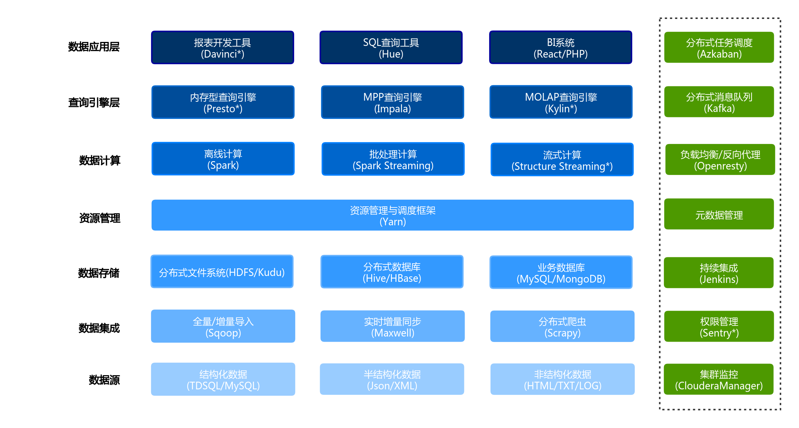
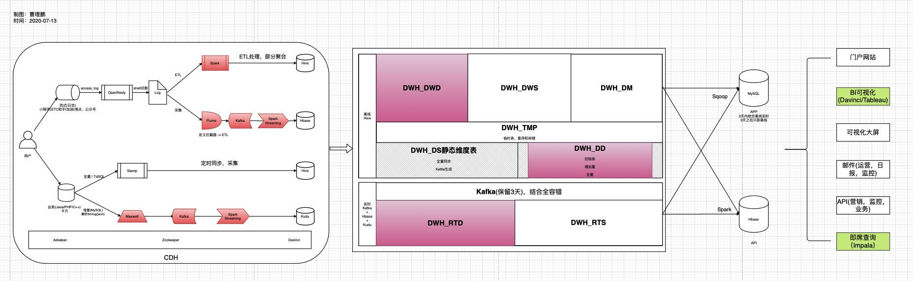

# SuperBigData
大数据全栈学习【又名超级大数据项目】

### 大数据架构图

### 大数据数据流

### 模块

##### 1. collection【生态组件集合模块】

##### 2. apache-spark【Spark模块】
##### 3. apache-flink-java【Flink Java模块】
##### 4. apache-flink-scala【Flink Scala模块】

##### 5. compute【计算层】
##### 6. storage【存储层】
##### 7. visual【可视化层】

##### 8. warehouse【数据仓库】
##### 9. services【服务模块】

##### 10. off-line【离线模块】
##### 11. real-time【实时模块】

##### 12. common【公共模块】
##### 13. producer【生产者】
